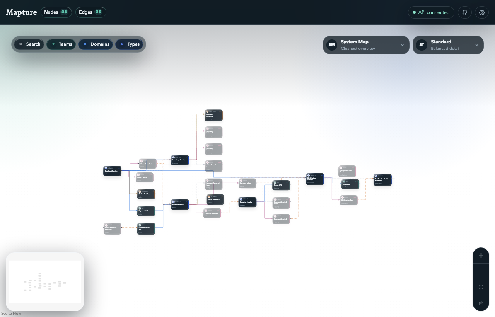

# Mapture

> Repo-native architecture mapping that stays close to the code.

[](https://github.com/mandotpro/mapture.dev/actions/workflows/ci.yml)
[](https://github.com/mandotpro/mapture.dev/actions/workflows/canary.yml)
[](https://github.com/mandotpro/mapture.dev/releases)
[](https://github.com/mandotpro/mapture.dev/blob/main/go.mod)
[](./LICENSE)

Mapture is an experimental architecture graph tool for repositories that want a lightweight, reviewable source of truth for system structure. It keeps teams, domains, scan settings, and UI defaults in `mapture.yaml`, derives event nodes from flat `@arch.*` and `@event.*` code comments, validates the result, and renders it as CLI output, Mermaid diagrams, and an interactive explorer.

> Status: early preview. Mapture is under active development and not production-ready yet, but the validator, graph pipeline, examples, and local explorer are ready for evaluation and feedback.



## 3-minute quickstart

Clone the repo and run the current examples locally:

```bash
git clone https://github.com/mandotpro/mapture.dev.git
cd mapture.dev

make help
go run src/main.go validate examples/demo
go run src/main.go serve examples/ecommerce
```

Then open the local explorer and inspect the bundled example graph.
For the repo’s day-to-day wrappers and testing helpers, run `make help`.

## Install

### Homebrew

Tap the dedicated Homebrew repository once:

```bash
brew tap mandotpro/mapture
```

Install the rolling canary channel today:

```bash
brew install mandotpro/mapture/mapture-canary
```

Stable `mapture` Homebrew packages are published from semver releases cut on the `0.x` branch.
Both channels install the same `mapture` binary, so switch channels by uninstalling the other formula first.

### Stable releases

Download semver-tagged binaries from [GitHub Releases](https://github.com/mandotpro/mapture.dev/releases). Stable releases are prepared from the `0.x` branch through automated release PRs.

### Canary builds

Rolling canary prereleases from the latest successful `main` build are published at [the canary release](https://github.com/mandotpro/mapture.dev/releases/tag/canary).

### Build from source

```bash
go install github.com/mandotpro/mapture.dev/cmd/mapture@latest
```

Install the current canary from source:

```bash
go install github.com/mandotpro/mapture.dev/cmd/mapture@canary
```

## What Mapture does today

- Validates teams, domains, and architecture references from a single repo config by default
- Scans Go, PHP, TypeScript, and JavaScript comment blocks for `@arch.*` and `@event.*` tags
- Builds a normalized graph with deterministic node and edge identities, including event nodes derived from code comments
- Exports Mermaid diagrams for filtered graph views
- Serves an interactive local explorer UI for browsing the graph
- Ships example fixtures for demo, ecommerce, migration, and invalid validation cases

## Current limitations

- Comments-first only. No AST or Tree-sitter source analysis yet.
- The public graph and UI are still evolving under pre-`v1.0.0` versioning.
- HTML export and AI bundle export are planned, but not yet implemented.
- Release channels are early: canary builds are convenient for evaluation, not stability guarantees.

## Why comments-first

Mapture is designed for teams that want architecture metadata to live close to the code and stay reviewable in pull requests.

That means:

- no heavy source instrumentation
- no separate modeling tool to keep in sync
- one small repo config for teams, domains, scanning, and UI defaults
- portable annotations that work across mixed-language repos

## Supported source languages

- Go
- PHP
- TypeScript
- JavaScript

## Examples

- [`examples/demo/`](./examples/demo/) — smallest end-to-end example
- [`examples/ecommerce/`](./examples/ecommerce/) — richer multi-language flow with services, APIs, databases, and events
- [`examples/migration/`](./examples/migration/) — incremental modernization scenario
- [`examples/invalid/`](./examples/invalid/) — intentionally broken fixtures used by validation tests

## Release channels

- Stable semver releases are cut from the `0.x` branch and published through automated release PRs.
- Merges into `main` do not produce stable tags; they update the rolling canary channel only.
- Canary builds are rolling prereleases from the latest successful `main` build.
- Homebrew canary installs are synced to `mandotpro/mapture` from the canary workflow.
- Stable version bumps are driven by Conventional Commit style squash-merge titles on `0.x`.

## Contributing and support

- [Contributing guide](./CONTRIBUTING.md)
- [Support guide](./SUPPORT.md)
- [Security policy](./SECURITY.md)
- [Code of Conduct](./CODE_OF_CONDUCT.md)

## Further reading

- [Product spec](./_docs/mapture-dev-prd-v1.md)
- [Type and schema docs](./_docs/types/)
- [Task history and roadmap notes](./_docs/tasks/)

## License

[MIT](./LICENSE)
