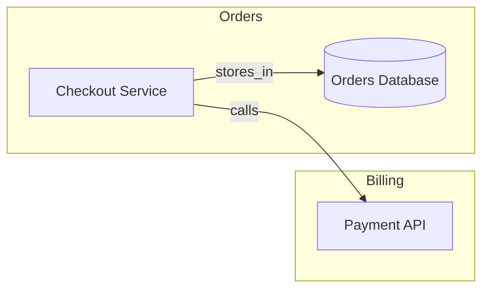
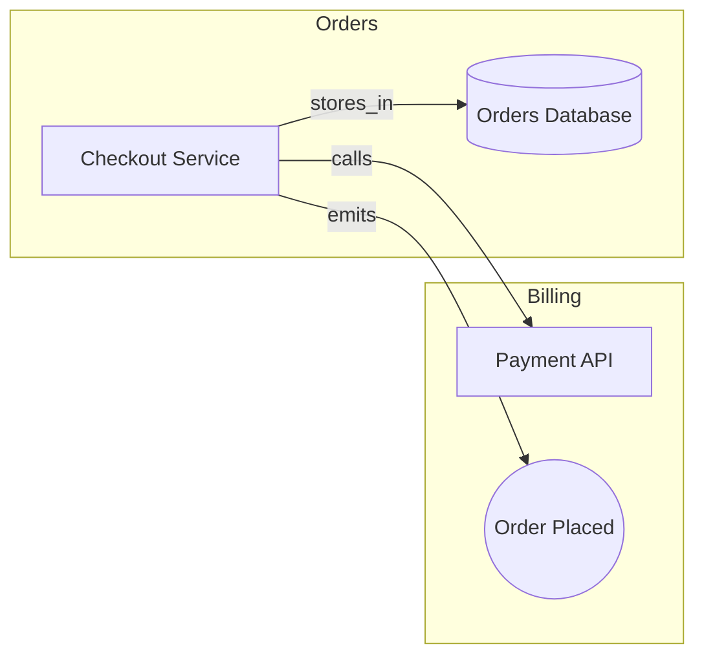

# PRD: Mapture.dev

## Document status
- Status: Draft v0.1
- License target: MIT
- Intended audience: Founders, maintainers, early contributors, design partners
- Primary output: Open-source CLI + local web UI + exportable HTML + AI-ready architecture bundle

---

## 1. Product summary

ArchMap is a repo-native architecture graph tool for distributed systems.

It lets teams define a small central catalog of architecture entities, annotate code with lightweight structured comments, validate those annotations against the catalog, and turn the result into:

- interactive architecture graphs
- CI validation reports
- per-domain and per-team views
- AI-ready data bundles
- reusable prompts / future MCP integration

The core idea is to keep architecture knowledge **inside the codebase**, close to the code, but still governed by a central catalog and validated automatically.

---

## 2. Problem statement

Large systems become hard to understand because architecture knowledge is fragmented across:
- code
- onboarding docs
- tribal knowledge
- diagrams that drift
- multiple languages and repos
- infra, services, APIs, events, and databases described in different ways

Existing approaches usually fail because they are one of:
- static analysis only
- diagram authoring only
- language-specific
- too heavyweight for normal engineering workflows
- disconnected from code review and CI
- not usable as structured context for AI systems

Teams need a way to:
- declare architecture metadata close to code
- keep ownership and domain information consistent
- generate live graphs and reports
- validate missing/stale metadata
- make the system explorable by humans and LLMs

---

## 3. Vision

Write architecture metadata once in the repo, then:

- validate it
- visualize it
- search and filter it
- trace dependencies through it
- export it for AI use
- keep it close to the code that implements it

Tagline candidates:
- Catalog your architecture. Validate it in code. Explore it as a graph.
- Turn code comments into a graph your team — and your LLM — can understand.
- Write architecture metadata once. Visualize it, validate it, and chat with it.

---

## 4. Goals

### Primary goals
1. Make architecture metadata easy to author and review in the codebase.
2. Support large distributed systems across multiple languages.
3. Provide one binary that runs locally and in CI.
4. Generate useful graphs with filtering and drilldown.
5. Validate metadata against a central catalog.
6. Make collected data easy to use with LLMs.

### Secondary goals
1. Reduce drift between intended and actual architecture.
2. Support gradual adoption in monorepos and service repos.
3. Be useful even in comments-only mode before deep static analysis exists.
4. Provide a polished OSS experience and website.

---

## 5. Non-goals (initially)

1. Full static call graph accuracy across all languages.
2. Replacing OpenAPI, protobuf, Terraform, or service catalogs.
3. Deep runtime tracing or APM replacement.
4. Full enterprise architecture modeling suite.
5. Automatic code modification.
6. Mandatory IDE plugin development in v1.
7. Graph database dependency as a requirement.
8. Parsing arbitrary prose comments without a structured format.

---

## 6. Target users

### Primary users
- Staff / principal engineers
- Platform / architecture teams
- Domain leads
- Teams operating distributed systems
- OSS users maintaining polyglot repos

### Secondary users
- Engineering managers
- Onboarding developers
- Incident responders
- AI-assisted engineering workflows
- Documentation owners

---

## 7. Core product concept

ArchMap combines three layers:

### A. Central catalog
A small set of repo-local files declaring canonical architecture facts:
- teams
- domains
- events
- optionally services, APIs, databases, topics later

### B. Code-local metadata
Simple structured comments placed near relevant code:
- service declarations
- API clients
- DB packages/repositories
- event triggers/listeners
- workflow edges
- ownership/domain declarations

### C. Derived graph
ArchMap scans comments, validates them against the catalog, and builds:
- normalized graph JSON
- HTML explorer
- Mermaid export
- AI bundle
- validation reports

---

## 8. Why comments-first

We explicitly chose a comments-first metadata layer because comments are:

- language agnostic
- portable across PHP, Go, and TypeScript
- close to the code
- reviewable in pull requests
- easy to scan without runtime dependencies
- usable in legacy code
- flexible enough to describe intended architecture, not only inferred code structure

This is preferable to relying only on:
- PHP attributes
- TypeScript decorators
- Go-specific constructs
- framework-specific metadata
- diagram DSLs detached from code

Comments are for humans to write. The scanner turns them into data. The catalog and schema validate the data.

---

## 9. Technology direction

### Core implementation
- Language: Go
- Distribution: single binary
- License: MIT
- Primary modes:
  - CLI
  - local server
  - static HTML export
  - AI export

### Why Go
- single executable distribution
- good cross-platform support
- easy CI usage
- easy local web server
- can embed frontend assets
- strong YAML and file-system tooling

### Likely supporting libraries
- Cobra for CLI
- go-yaml for YAML parsing
- embedded static assets for UI
- later: Tree-sitter integration or language-specific parsers if needed

---

## 10. Product surfaces

### CLI
Examples:
```bash
archmap init .
archmap validate .
archmap scan .
archmap graph .
archmap serve .
archmap export-html . -o architecture-report.html
archmap export-ai .
```

### Local web UI
Served by the binary:
```bash
archmap serve .
```

Capabilities:
- browse graph
- filter by team/domain/type
- inspect node details
- drill into neighbors
- search nodes

### Static HTML export
```bash
archmap export-html . -o architecture-report.html
```

Self-contained HTML for:
- sharing
- CI artifacts
- docs sites
- demos

### AI export
```bash
archmap export-ai .
```

Outputs:
- graph.json
- entity summaries
- overview docs
- prompt pack

---

## 11. Repository integration model

ArchMap runs against a folder or repo root.

### Recommended repo structure
```text
repo/
  archmap.yaml
  architecture/
    teams.yaml
    domains.yaml
    events.yaml
  services/
  pkg/
  src/
  scripts/
```

### Example usage
```bash
archmap validate .
archmap serve .
archmap export-html . -o architecture.html
```

### Company usage model
- download binary via GitHub releases or internal artifact store
- wrap with script in repo
- pin version per repo
- run in CI

---

## 12. Configuration model

### Repo config: `archmap.yaml`
Purpose:
- locate catalogs
- define include/exclude paths
- enable languages
- control validation behavior

Example:
```yaml
version: 1

catalog:
  dir: ./architecture

scan:
  include:
    - ./services
    - ./pkg
    - ./src
  exclude:
    - ./vendor
    - ./node_modules
    - ./dist
    - ./build

languages:
  php: true
  go: true
  typescript: true

comments:
  style: tags

validation:
  failOnUnknownDomain: true
  failOnUnknownTeam: true
  failOnUnknownEvent: true
  requireMetadataOn:
    - trigger
    - listener
```

---

## 13. Catalog model

We agreed the single source of truth should be a set of files in a central directory.

### Initial catalog files
- `teams.yaml`
- `domains.yaml`
- `events.yaml`

Later possible:
- `services.yaml`
- `apis.yaml`
- `databases.yaml`
- `topics.yaml`
- `workflows.yaml`

### 13.1 teams.yaml
Canonical ownership information.

Example:
```yaml
teams:
  - id: team-commerce
    name: Commerce Team
    contact: commerce@example.com

  - id: team-billing
    name: Billing Team
    contact: billing@example.com
```

Required fields:
- `id`
- `name`

Optional fields:
- `contact`
- `slack`
- `email`
- `tags`

### 13.2 domains.yaml
Canonical business or technical domains.

Example:
```yaml
domains:
  - id: orders
    name: Orders
    ownerTeams: [team-commerce]
    allowedOutboundDomains: [billing, notifications]

  - id: billing
    name: Billing
    ownerTeams: [team-billing]
```

Required fields:
- `id`
- `name`
- `ownerTeams`

Optional fields:
- `description`
- `allowedOutboundDomains`
- `allowedInboundDomains`
- `tags`

### 13.3 events.yaml
Canonical event catalog.

Example:
```yaml
events:
  - id: order.placed
    name: Order Placed
    domain: orders
    ownerTeam: team-commerce
    kind: domain
    visibility: internal
    status: active
    version: 1
    allowedTargetDomains: [billing, notifications]
```

Required fields:
- `id`
- `name`
- `domain`
- `ownerTeam`
- `kind`
- `visibility`
- `status`

Optional fields:
- `description`
- `version`
- `payloadSchema`
- `allowedTargetDomains`
- `allowedProducers`
- `allowedConsumers`
- `deprecated`
- `replacedBy`
- `tags`

---

## 14. Comment metadata format

### Principle
Source comments should stay simple and readable. They should not be JSON blobs in comments.

### Default style
Flat `@key value` tags.

### 14.1 Architecture comments
Used for service / API / DB / general dependency graphing.

Example:
```php
/**
 * @arch.node service checkout-service
 * @arch.name Checkout Service
 * @arch.domain orders
 * @arch.owner team-commerce
 *
 * @arch.calls api payment-api
 * @arch.stores_in database orders-db
 */
final class CheckoutService {}
```

Equivalent style in Go:
```go
// @arch.node database orders-db
// @arch.name Orders Database
// @arch.domain orders
// @arch.owner team-commerce
package ordersdb
```

Equivalent style in TS:
```ts
/**
 * @arch.node api payment-api
 * @arch.name Payment API
 * @arch.domain billing
 * @arch.owner team-billing
 */
export class PaymentApiClient {}
```

### Required `@arch.*` fields for nodes
- `@arch.node <type> <id>`
- `@arch.name <human name>`
- `@arch.domain <domain>`
- `@arch.owner <team>`

### Supported node types (v1)
- `service`
- `api`
- `database`
- `event`

### Supported relation tags (v1)
- `@arch.calls <type> <id>`
- `@arch.depends_on <type> <id>`
- `@arch.stores_in <type> <id>`
- `@arch.reads_from <type> <id>`

### 14.2 Event comments
Used for event definitions, triggers, listeners, and related flows.

Example trigger:
```php
/**
 * @event.id order.placed
 * @event.role trigger
 * @event.domain orders
 * @event.producer checkout.place_order
 * @event.phase post-commit
 */
$bus->dispatch(new OrderPlaced($orderId));
```

Example listener:
```ts
/**
 * @event.id order.placed
 * @event.role listener
 * @event.domain billing
 * @event.consumer capture_payment
 */
eventBus.on("order.placed", handleCapturePayment)
```

### Required event fields
Always required:
- `@event.id`
- `@event.role`
- `@event.domain`

Conditional:
- if `role=trigger` → require `@event.producer`
- if `role=listener` → require `@event.consumer`

Optional:
- `@event.owner`
- `@event.phase`
- `@event.topic`
- `@event.version`
- `@event.notes`

### Supported event roles (v1)
- `definition`
- `trigger`
- `listener`
- `bridge-out`
- `bridge-in`
- `publisher`
- `subscriber`

---

## 15. Validation model

Validation happens in layers.

### Layer 1: file/config validation
- required repo config fields exist
- catalogs can be loaded
- YAML shape is valid

### Layer 2: catalog validation
- team IDs unique
- domain IDs unique
- event IDs unique
- event domain exists
- event owner team exists
- domain owner teams exist

### Layer 3: comment shape validation
- required tags exist
- known tag keys only
- role/type enums valid
- relation tags have target type and ID
- duplicate/conflicting tags handled predictably

### Layer 4: catalog consistency validation
- `@arch.domain` exists in domains catalog
- `@arch.owner` exists in teams catalog
- `@event.id` exists in events catalog
- `@event.domain` matches event catalog domain
- inline owner matches catalog owner if present
- deprecated events are flagged according to policy

### Layer 5: attachment validation
- comment is attached to a nearby symbol or location
- for events:
  - trigger comment should be attached to a dispatch-like usage or allowed generic location
  - listener comment should be attached to a handler/registration location
- for architecture nodes:
  - node comment should be attached to a file/symbol/package/class/module/section

### Layer 6: graph validation
- referenced target nodes should exist
- duplicate node IDs should fail
- cross-domain edges can be checked
- missing ownership/domain can be flagged
- orphaned nodes/events can be reported

### CLI behavior
- warnings and errors
- machine-readable JSON report
- non-zero exit code on failure

---

## 16. Enums / constrained values

### Event kind
- `domain`
- `integration`
- `system`
- `internal`

### Event visibility
- `internal`
- `public`
- `private`
- `deprecated`

### Event status
- `active`
- `deprecated`
- `experimental`

### Event phase
- `pre-commit`
- `post-commit`
- `async`
- `integration`

### Event role
- `definition`
- `trigger`
- `listener`
- `bridge-out`
- `bridge-in`
- `publisher`
- `subscriber`

### Architecture node type
- `service`
- `api`
- `database`
- `event`

---

## 17. Internal normalized graph model

The scanner should convert comments and catalog metadata into a normalized graph.

### Example
```json
{
  "nodes": [
    {
      "id": "service:checkout-service",
      "type": "service",
      "name": "Checkout Service",
      "domain": "orders",
      "owner": "team-commerce",
      "file": "src/orders/CheckoutService.php",
      "line": 12,
      "summary": "Places orders and coordinates checkout flow."
    },
    {
      "id": "api:payment-api",
      "type": "api",
      "name": "Payment API",
      "domain": "billing",
      "owner": "team-billing"
    },
    {
      "id": "database:orders-db",
      "type": "database",
      "name": "Orders Database",
      "domain": "orders",
      "owner": "team-commerce"
    }
  ],
  "edges": [
    {
      "from": "service:checkout-service",
      "to": "api:payment-api",
      "type": "calls"
    },
    {
      "from": "service:checkout-service",
      "to": "database:orders-db",
      "type": "stores_in"
    }
  ]
}
```

### Edge types (v1)
- `calls`
- `depends_on`
- `stores_in`
- `reads_from`
- `emits`
- `consumes`

---

## 18. Diagram output

### Initial output modes
1. Mermaid export
2. Interactive HTML graph
3. JSON graph export

### Mermaid example


### UI goals
- search
- filter by team/domain/type
- hide/show edge types
- click node for details
- isolate neighborhood
- simple and fast
- self-contained HTML export

### Candidate UI libraries
Initial recommendation:
- Cytoscape.js or vis-network for v1 simplicity
- React Flow can be considered later if richer node-based UI becomes necessary

---

## 19. AI-first architecture

ArchMap should be AI-first from the start.

### Meaning of AI-first here
The collected architecture data should be easy to:
- upload to any LLM
- retrieve semantically
- query programmatically
- summarize
- trace blast radius from
- explain ownership and flows

### AI outputs
`archmap export-ai .` should generate:

```text
.archmap/ai/
  graph.json
  entities/
    service-checkout-service.md
    api-payment-api.md
    event-order.placed.md
  views/
    system-overview.md
    domain-orders.md
    team-commerce.md
  prompts/
    explain-node.md
    blast-radius.md
    cross-domain-risk.md
  glossary.md
```

### Per-entity summaries
Each node should have a compact natural-language summary for retrieval.

Example:
```md
# service:checkout-service

Type: service
Domain: orders
Owner: team-commerce

Depends on:
- api:payment-api
- database:orders-db

Summary:
Checkout Service places orders, stores them in Orders Database, and calls Payment API during checkout.
```

### Prompt pack
Examples:
- Explain this service and all direct dependencies
- What breaks if this API changes?
- Show cross-domain dependencies owned by Team X
- Trace checkout flow through services, APIs, events, and databases
- Find undocumented or orphaned nodes

### Future MCP direction
Later, ArchMap can expose:
- resources: graph, domains, teams, events, services
- tools: find neighbors, trace paths, blast radius, missing metadata
- prompts: built-in architecture analysis prompts

This is future-facing, not required for v0.1.

---

## 20. How AI and graph features complement each other

The graph UI is for humans exploring visually.

The AI bundle is for:
- semantic search
- architecture Q&A
- change impact analysis
- onboarding assistance
- prompt injection of architecture context into developer workflows

This dual-mode design is core to the product.

---

## 21. Initial commands

### Required commands
- `archmap init [path]`
- `archmap validate [path]`
- `archmap scan [path]`
- `archmap graph [path]`
- `archmap serve [path]`
- `archmap export-html [path] -o <file>`
- `archmap export-ai [path]`

### Command goals

#### `init`
Bootstrap:
- `archmap.yaml`
- `architecture/teams.yaml`
- `architecture/domains.yaml`
- `architecture/events.yaml`

#### `validate`
- validate config, catalogs, comments, graph references
- print issues
- return CI-friendly exit code

#### `scan`
- parse comments
- build normalized graph
- emit graph JSON

#### `graph`
- produce graph-oriented exports

#### `serve`
- start local explorer UI

#### `export-html`
- create self-contained HTML explorer/report

#### `export-ai`
- create AI bundle

---

## 22. Parsing approach

### v1 parsing strategy
Comments-only, with lightweight source attachment.

The tool should:
1. walk files under include paths
2. detect supported files by extension
3. read comment blocks
4. parse `@arch.*` and `@event.*` tags
5. attach comment blocks to nearby source location
6. convert them to normalized metadata objects
7. validate and merge into graph

### Language support (v1)
- PHP
- Go
- TypeScript / JavaScript

### Why comments-only first
- simplest MVP
- portable across languages
- minimal framework assumptions
- avoids premature deep parsing complexity

### Later enhancements
- smarter language-aware attachment
- optional AST assistance
- inferred edges compared to declared edges
- code pattern suggestions for undocumented dependencies

---

## 23. IDE / authoring experience

### v1 approach
- keep authoring simple
- rely on readable comments + CI validation
- provide snippet examples in docs
- optionally support editor snippets / templates
- optional YAML/JSON/CUE assistance for catalogs

### Long-term possibilities
- VS Code extension for tag snippets and validation
- JetBrains live templates
- MCP-assisted authoring
- comment completion from catalog values

IDE plugin work is not a v1 requirement.

---

## 24. Catalog technology choice

### Initial source of truth
YAML in repo-local files.

Reason:
- familiar to most teams
- easy to review
- easy to edit
- easy to bootstrap

### Future enhancement
Investigate CUE as a stronger schema/validation layer behind the scenes or as an advanced authoring mode.

Current decision:
- v1 user-facing catalog format: YAML
- keep internal model abstract enough to allow CUE later

---

## 25. Open-source positioning

### License
MIT

### Product character
- simple
- pragmatic
- repo-native
- developer-first
- AI-friendly
- no heavyweight infra required
- single binary

### Differentiation
ArchMap is not:
- only a static analysis engine
- only a diagramming DSL
- only an IDE plugin
- only an enterprise architecture repository

It is:
- catalog-driven
- comments-first
- validation-capable
- graph-centric
- AI-ready

---

## 26. Project naming

Working name:
- ArchMap

Other candidates discussed:
- ArchGraph
- CodeAtlas
- ArchScope
- SystemGraph

Preferred current choice:
- **ArchMap**

Suggested site:
- `archmap.dev`

Suggested repo:
- `archmap`

---

## 27. Website goals

The website should show visual impact and the benefit of adding metadata to code.

### Key sections
1. Hero
2. “How it works”
3. Before / after
4. Live graph screenshots or demo
5. Code comments example
6. Catalog example
7. Validation report example
8. AI export / chat use cases
9. Quick start
10. OSS + MIT messaging

### Core message
Add small structured comments and a lightweight catalog, then get:
- system maps
- validation
- ownership visibility
- drilldown
- AI-ready context

---

## 28. Success criteria

### v0.1 success
- a user can annotate a small repo and get a graph
- output is understandable
- validation catches obvious issues
- setup is under 10 minutes

### v0.2 success
- usable in CI
- clear non-zero exit behavior
- good error output
- initial adopters trust validation

### v0.3 success
- users can explore graph interactively
- filtering/drilldown feels useful
- screenshots/demo clearly show value

### v1.0 success
- stable format
- contributors can extend node/edge types
- supports real polyglot repos
- good docs and examples
- enough polish to become a community tool

---

## 29. MVP roadmap

### v0.1.0 — Comments to graph
Scope:
- Go binary
- YAML catalogs
- comments-only scanner
- node + edge extraction
- graph JSON output
- Mermaid export
- static HTML output

Node types:
- service
- api
- database
- event

Edge types:
- calls
- depends_on
- stores_in
- reads_from
- emits
- consumes

### v0.2.0 — Validation + CI
Add:
- validate command
- issue reporting
- config discovery
- duplicate ID checks
- unknown team/domain/event checks
- required metadata checks
- machine-readable validation report

### v0.3.0 — Interactive explorer
Add:
- local server
- search
- filtering
- click details
- neighborhood drilldown
- simple grouping by domain/team/type

### v0.4.0 — Better source attachment
Add:
- stronger file/line/symbol association
- language-specific refinements for PHP/Go/TS

### v0.5.0 — Event/workflow views
Add:
- richer event flow support
- producer/consumer views
- workflow tracing
- cross-domain validations

### v1.0.0 — Stable public platform
Add:
- stable schemas/formats
- polished docs
- examples
- migration guidance
- strong HTML explorer
- AI export stability

---

## 30. Risks

1. Too much schema complexity too early
2. Overloading comments with excessive metadata
3. Trying to infer too much before the comments-first model proves itself
4. Building a UI too heavy for the initial value
5. Failing to differentiate from existing graph/code tools
6. Ignoring onboarding/documentation for OSS users

### Mitigations
- keep v1 comment format simple
- keep YAML catalogs minimal
- keep first graph model small
- invest in examples
- show clear visual and AI value early

---

## 31. Open questions

1. Should services/APIs/databases later become first-class catalog files, or remain comments-derived by default?
2. Should CUE back the schema/validation layer in v1.x or only later?
3. Which UI library will feel simplest while still allowing filtering and drilldown?
4. Should events remain a first-class node type from v0.1, or be emphasized starting in v0.5?
5. How much language-aware parsing is needed before public launch?

---

## 32. Immediate next steps

1. Finalize repository name and branding.
2. Define exact v0.1 comment grammar.
3. Define exact graph JSON schema.
4. Define `archmap.yaml` schema.
5. Create sample demo repo with PHP + Go + TS.
6. Implement:
   - catalog loader
   - comment parser
   - graph builder
   - validator
   - Mermaid export
7. Build simple HTML explorer.
8. Build AI export command.
9. Launch site with before/after demo and screenshots.

---

## 33. Appendix: minimal end-to-end example

### Catalog
`architecture/teams.yaml`
```yaml
teams:
  - id: team-commerce
    name: Commerce Team
  - id: team-billing
    name: Billing Team
```

`architecture/domains.yaml`
```yaml
domains:
  - id: orders
    name: Orders
    ownerTeams: [team-commerce]
  - id: billing
    name: Billing
    ownerTeams: [team-billing]
```

`architecture/events.yaml`
```yaml
events:
  - id: order.placed
    name: Order Placed
    domain: orders
    ownerTeam: team-commerce
    kind: domain
    visibility: internal
    status: active
```

### Code comments
```php
/**
 * @arch.node service checkout-service
 * @arch.name Checkout Service
 * @arch.domain orders
 * @arch.owner team-commerce
 *
 * @arch.calls api payment-api
 * @arch.stores_in database orders-db
 */
final class CheckoutService {}
```

```ts
/**
 * @arch.node api payment-api
 * @arch.name Payment API
 * @arch.domain billing
 * @arch.owner team-billing
 */
export class PaymentApiClient {}
```

```go
// @arch.node database orders-db
// @arch.name Orders Database
// @arch.domain orders
// @arch.owner team-commerce
package ordersdb
```

### Event trigger
```php
/**
 * @event.id order.placed
 * @event.role trigger
 * @event.domain orders
 * @event.producer checkout.place_order
 * @event.phase post-commit
 */
$bus->dispatch(new OrderPlaced($orderId));
```

### Generated Mermaid


---

## 34. One-sentence product definition

ArchMap is an MIT-licensed, single-binary, repo-native architecture graph tool that turns lightweight code comments and YAML catalogs into validated dependency maps, interactive diagrams, and AI-ready architecture context.
